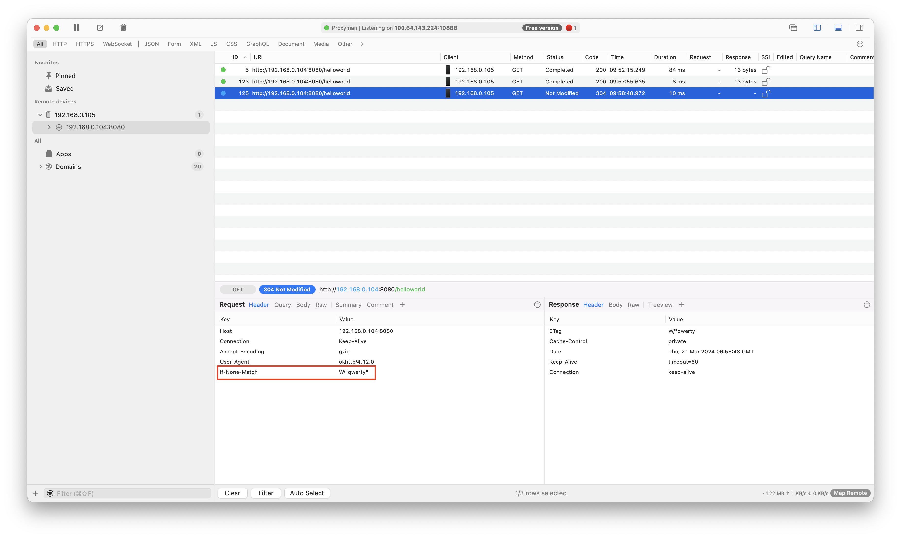

# Okhttp Cache-Control Playground

Repository for experiments with cache implementation in okhttp. Made public to illustrate [this question](https://stackoverflow.com/questions/78196076/okhttp-cache-control-no-cache-processing-strategy).

# `Cache-Control: no-cache`

1. Make `GET` request with `no-cache`.


2. Server responds `200` and returns `Cache-Control: private` with `ETag: W/qwerty`.


3. We can verify this using proxy.


4. After this the response goes into the cache as expected.


5. Make `GET` request with `no-cache` again. It will not be sent as a conditional request. There is no `If-None-Match` header added and therefore no `304` response.


# No `Cache-Control` header

6. Make `GET` request with missing `Cache-Control` header.


7. And now we see a conditional request.



# Observed Behavior

1. `no-cache` in okhttp never hits the cache.
2. Missing `Cache-Control` allows to use a private cache and not read the response body.

# How to Run

There are prebuilt binaries

```bash
# Client Android App
adb install android-app-debug.apk
```

```bash
# REST API String App
java -jar spring-app-fat.jar

# Requires Java 21
JAVA_HOME="$JAVA_HOME_21" java -jar spring-app-fat.jar
```

Or you can build them from source

```bash
cd android/
JAVA_HOME="$JAVA_HOME_17" ./gradlew app:assemble
adb install app/build/outputs/apk/debug/app-debug.apk
```

```bash
cd spring/
JAVA_HOME="$JAVA_HOME_21" ./mvnw clean spring-boot:run
```
